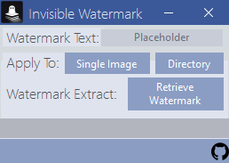
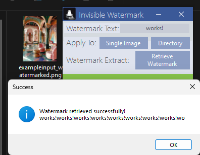
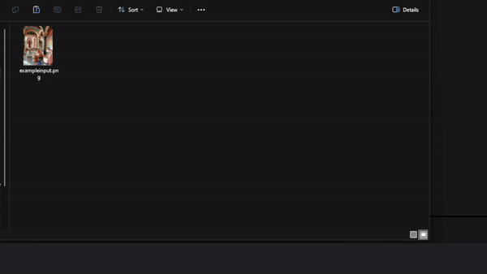

# Invisible Image Watermarking Tool

  

A C# application for seamlessly adding and retrieving invisible watermarks in images using advanced pixel manipulation techniques.

## 🌟 Features

- 🖼️ Add invisible watermarks to single image
- 📁 Process entire directories, including subdirectories
- 🔍 Retrieve and display watermarks from processed images
- 💻 Modern and intuitive user interface powered by Guna UI 2

## 🔧 How It Works

It employs a sophisticated pixel manipulation technique to embed invisible watermarks:

1. Images are composed of pixels, each with Red, Green, and Blue (RGB) channels.
2. Channel values range from 0 to 255.
3. We embed the watermark by adjusting these channel values:
   - Odd values represent white pixels in the watermark
   - Even values represent black pixels in the watermark
4. These subtle adjustments are imperceptible to the human eye but detectable by application.

## 📸 Screenshots

  
  

## 🎥 Demo

  

Can't see the demo? [Watch the video here](Assets/example.mp4)

## 🚀 Quick Start

1. Visit the project's GitHub page: [GitHub Repository Link](https://github.com/ataoytun/InvisibleWatermark)
2. Click on the **Code** button and then select **Download ZIP** from the dropdown menu.
3. Extract the downloaded ZIP file and navigate into the extracted folder.
4. Open the solution in Visual Studio by clicking csproj file.
5. Restore NuGet packages
6. Build and run the application

## 🖱️ Usage

### Adding a Watermark

1. Launch the application
2. For a single image:
- Click "Single Image"
- Select an image file via the opened dialog
3. For multiple images:
- Click "Directory"
- Choose a directory via the opened folder dialog
4. Enter your watermark text
5. Watermarked images will be saved in the `Output` folder

### Retrieving a Watermark

1. Launch the application
2. Click "Retrieve Watermark"
3. Select a watermarked image via the opened dialog
4. View the extracted watermark in the display box

## 📦 Dependencies

- .NET Framework 4.7.2 or higher
- [Guna UI 2](https://gunaui.com/) for the sleek user interface

## 🤝 Contributing

Contributions are welcome! Please feel free to fork the repository and submit pull requests. You can also open issues to report bugs or suggest new features.

1. **Fork the Repository:** Create your own fork and work on your enhancements or fixes.
2. **Create Pull Requests:** Submit pull requests for your changes to be reviewed and merged into the main project.
3. **Report Issues:** Use the GitHub issues tracker to report bugs or suggest enhancements.

## 📄 License

This project is licensed under the MIT License - see the [LICENSE](LICENSE) file for details.

## 🙏 Acknowledgments

- [Guna UI](https://gunaui.com/) for the stunning UI components
- Inspired by cutting-edge digital watermarking techniques and research
